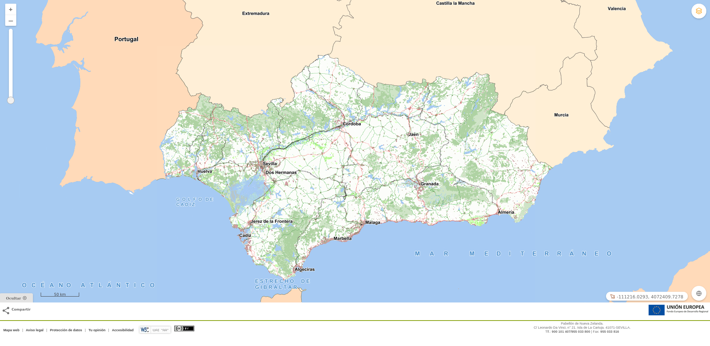

# MapFooter

[](https://github.com/sigcorporativo-ja/Mapea4-dev-webpack)

## Descripción

 Plugin de [Mapea](https://github.com/sigcorporativo-ja/Mapea4) para la generación automática de pie de pagina. 



Para el correcto funcionamiento del plugin es necesario pasarle en su constructor un objeto **json** con los parámetros esperados.
### Parámetros del plugin

```javascript
const configIECA = {
  open: true,
  htmlCode: '<div id="social"  title="Compartir"> <ul> <li class="no_imprimir"><a id="btnCompartir" href="#">&nbsp;<span>Compartir</span></a> <ul id="soc_compartir"> <li><a href="https://www.facebook.com/sharer.php?u='+window.location.href+'&amp;t=+Visualizador+IECA&amp;d=" title="Compartir en Facebook" target="_blank">&nbsp;<span>Facebook</span></a></li><li><a href="https://twitter.com/home?status=Visualizador-'+ window.location.href+'%20v%C3%ADa%20@IECA_Andalucia" title="Compartir en Twitter" target="_blank">&nbsp;<span>Twitter</span></a></li><li><a href="https://www.linkedin.com/shareArticle?mini=true&amp;url='+ window.location.href+'&amp;title=+Visualizador+IECA" title="Compartir en LinkedIn" target="_blank">&nbsp;<span>LinkedIn</span></a></li><li><a href="mailto:?subject=Compartiendo%20por%20correo%20electr%C3%B3nico&amp;body=%20Visualizador:%0D%0A'+ window.location.href+'" title="Compartir por correo electr&oacute;nico" target="_blank">&nbsp;<span>e-mail</span></a></li></ul> </li></ul> </div><div id="footer"> <div id="piea"> <div class="lineacolor fondocolor1">&nbsp;</div><div>&nbsp;</div><div> <div id="piea1"> <a href="https://www.juntadeandalucia.es/institutodeestadisticaycartografia/ieagen/mapaWeb/index.htm" class="enlaces" accesskey="m">Mapa web</a> | <a href="https://www.juntadeandalucia.es/institutodeestadisticaycartografia/ieagen/avisoLegal/index.htm" class="enlaces" accesskey="l">Aviso legal</a> | <a href="https://www.juntadeandalucia.es/institutodeestadisticaycartografia/protecciondedatos/index.html" class="enlaces" accesskey="p">Protecci&oacute;n de datos</a> | <a href="https://www.juntadeandalucia.es/institutodeestadisticaycartografia/buzon_web/index.jsp" class="enlaces" accesskey="o">Tu opini&oacute;n</a> | <a href="https://www.juntadeandalucia.es/institutodeestadisticaycartografia/ieagen/accesibilidad/index.htm" class="enlaces" accesskey="a">Accesibilidad</a>  <a href="https://www.juntadeandalucia.es/institutodeestadisticaycartografia/ieagen/avisoLegal/index.htm#cc" class="enlaceimg"></a> </div><div id="piea2"> Pabell&oacute;n de Nueva Zelanda. <br>C/ Leonardo Da Vinci, n&deg; 21. Isla de La Cartuja. 41071-SEVILLA.<br>Tlf.: <strong>900 101 407/955 033 800</strong> | Fax: <strong>955 033 816</strong><br></div></div></div></div>',
  cssList: [
    'https://www.juntadeandalucia.es/institutodeestadisticaycartografia/portal/css/estiloCabecera2015.css',
    'https://www.juntadeandalucia.es/institutodeestadisticaycartografia/portal/css/estiloGenerico.css',
    'https://www.juntadeandalucia.es/institutodeestadisticaycartografia/portal/css/estiloVisor.css',
  ]
}
```

- **open [boolean]:**  Parámetro que inicializa el plugin con el pie de página abierto o cerrado.
- **htmlCode [string]:** codigo html a partir del cual se construye el pié de página
- **cssList [array]:**  Listado de archivos css que se inyectan en el visor para su uso en el pie de página


## Recursos y configuración

- js: mapfooter.ol.min.js
- css: mapfooter.min.css

```javascript

const configIECA = {
  open: true,
  htmlCode: '<div id="social"  title="Compartir"> <ul> <li class="no_imprimir"><a id="btnCompartir" href="#">&nbsp;<span>Compartir</span></a> <ul id="soc_compartir"> <li><a href="https://www.facebook.com/sharer.php?u='+window.location.href+'&amp;t=+Visualizador+IECA&amp;d=" title="Compartir en Facebook" target="_blank">&nbsp;<span>Facebook</span></a></li><li><a href="https://twitter.com/home?status=Visualizador-'+ window.location.href+'%20v%C3%ADa%20@IECA_Andalucia" title="Compartir en Twitter" target="_blank">&nbsp;<span>Twitter</span></a></li><li><a href="https://www.linkedin.com/shareArticle?mini=true&amp;url='+ window.location.href+'&amp;title=+Visualizador+IECA" title="Compartir en LinkedIn" target="_blank">&nbsp;<span>LinkedIn</span></a></li><li><a href="mailto:?subject=Compartiendo%20por%20correo%20electr%C3%B3nico&amp;body=%20Visualizador:%0D%0A'+ window.location.href+'" title="Compartir por correo electr&oacute;nico" target="_blank">&nbsp;<span>e-mail</span></a></li></ul> </li></ul> </div><div id="footer"> <div id="piea"> <div class="lineacolor fondocolor1">&nbsp;</div><div>&nbsp;</div><div> <div id="piea1"> <a href="https://www.juntadeandalucia.es/institutodeestadisticaycartografia/ieagen/mapaWeb/index.htm" class="enlaces" accesskey="m">Mapa web</a> | <a href="https://www.juntadeandalucia.es/institutodeestadisticaycartografia/ieagen/avisoLegal/index.htm" class="enlaces" accesskey="l">Aviso legal</a> | <a href="https://www.juntadeandalucia.es/institutodeestadisticaycartografia/protecciondedatos/index.html" class="enlaces" accesskey="p">Protecci&oacute;n de datos</a> | <a href="https://www.juntadeandalucia.es/institutodeestadisticaycartografia/buzon_web/index.jsp" class="enlaces" accesskey="o">Tu opini&oacute;n</a> | <a href="https://www.juntadeandalucia.es/institutodeestadisticaycartografia/ieagen/accesibilidad/index.htm" class="enlaces" accesskey="a">Accesibilidad</a>  <a href="https://www.juntadeandalucia.es/institutodeestadisticaycartografia/ieagen/avisoLegal/index.htm#cc" class="enlaceimg"></a> </div><div id="piea2"> Pabell&oacute;n de Nueva Zelanda. <br>C/ Leonardo Da Vinci, n&deg; 21. Isla de La Cartuja. 41071-SEVILLA.<br>Tlf.: <strong>900 101 407/955 033 800</strong> | Fax: <strong>955 033 816</strong><br></div></div></div></div>',
  cssList: [
    'https://www.juntadeandalucia.es/institutodeestadisticaycartografia/portal/css/estiloCabecera2015.css',
    'https://www.juntadeandalucia.es/institutodeestadisticaycartografia/portal/css/estiloGenerico.css',
    'https://www.juntadeandalucia.es/institutodeestadisticaycartografia/portal/css/estiloVisor.css',
  ]
}

const mp = new Mapfooter(configIECA);
map.addPlugin(mp);
```
## Visor Demo
Para comprobar el funcionamiento de este plugin se puede acceder al siguiente enlace [Ejemplo Visor](https://EnriqueMonreal.github.io/mapfooter/).

## Video Demo

Para comprobar el funcionamiento de este plugin se puede descargar el [Video](https://github.com/EnriqueMonreal/mapfooter/blob/master/docs/video/mapFooter.webm?raw=true) el cual contempla la configuración y carga del plugin con diferentes pies de páginas